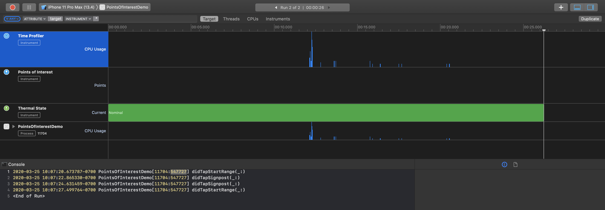

#  PointsOfInterest Bug

This is a demonstration of a problem that manifests itself in Xcode 11.4 where “Points of Interest” are not captured in Instruments. In Xcode 11.4 (11E146), I see:

But in Xcode 11.3.1 (11C505) and earlier, it works fine:

I’m running Catalina 10.15.4 (19E266) on MacBook Pro (15-inch, 2018). The behavior did not appear to change based upon the iOS simulator version. It appears to work for macOS targets, though. 

---

March 25, 2020

Copyright (c) 2020 Rob Ryan. All Rights Reserved.

See [License](LICENSE.md).
